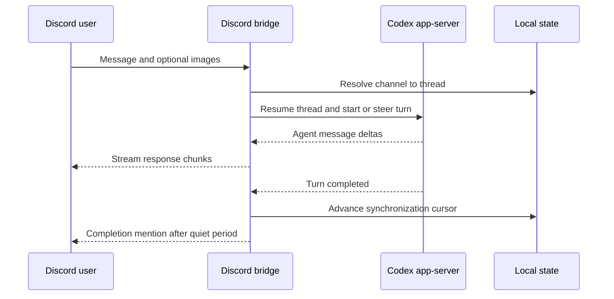

# Architecture

## Components

- `src/index.js` loads configuration and starts the bridge.
- `src/codex-app-server.js` owns the JSON-RPC subprocess connection to
  `codex app-server`.
- `src/discord-bridge.js` maps Discord events to Codex turns and Codex events
  back to Discord.
- `src/state-store.js` persists channel and thread mappings locally.
- `src/thread-sync.js` discovers and synchronizes sessions started outside
  Discord without replaying old output.
- `src/discord-attachments.js` validates and downloads image attachments.
- `src/notify-discord.js` supports Codex's standalone completion notification.

## Message Flow

The bridge is local software. Discord is the remote transport, while Codex
authentication, execution, files, and session history remain on the host.

## State and Recovery

`data/session-map.json` is the durable mapping between Discord channel IDs and
Codex thread IDs. It also stores synchronization cursors that prevent old turns
from being reposted after restart. Deployment preserves this file.

When a mapped thread cannot be resumed, the bridge creates a replacement thread
and reuses the existing Discord channel. Project categories and channels are
ordered by recent activity. Old inactive channels can be pruned when configured
Discord limits are reached.

## Trust Model

The Discord bot token authenticates the transport. `OWNER_DISCORD_USER_IDS`
provides the application authorization boundary. Codex sandbox and approval
settings determine the host access granted to an accepted message. See
`SECURITY.md` before exposing the bot to other server members.
